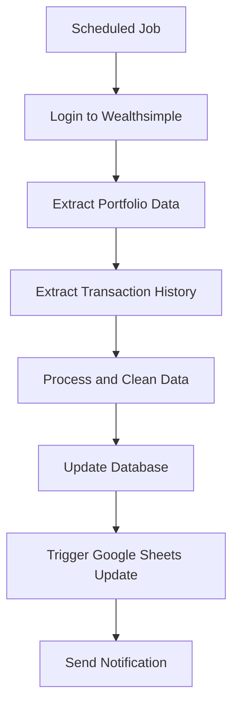
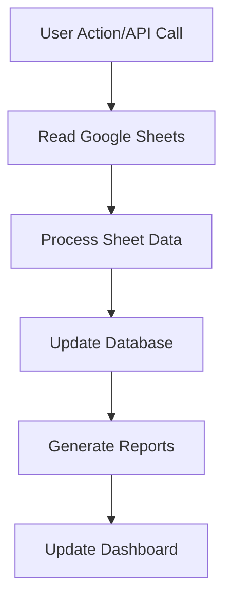
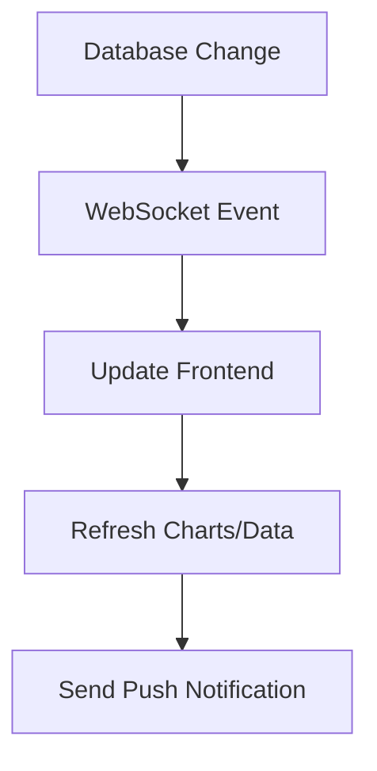

# Investment Tracker - Data Architecture

## Overview
This document outlines the data sources, storage, and integration strategy for the investment and budget tracker application.

## Data Sources

### 1. Wealthsimple Investment Data
**Source:** Wealthsimple Personal/Wealthsimple Trade
**Integration Method:** Web Scraping (Primary) + CSV Import (Backup)
**Data Points:**
- Portfolio holdings (stocks, ETFs, crypto)
- Current market values
- Transaction history
- Performance metrics
- Asset allocation

**Technical Implementation:**
- Puppeteer/Playwright for browser automation
- Scheduled daily/weekly data pulls
- Secure credential storage (environment variables)
- Error handling and retry logic

### 2. Google Sheets Integration
**Source:** Google Sheets API v4
**Use Cases:**
- Budget planning and tracking
- Manual transaction entries
- Financial goals and targets
- Custom calculations and reports

**Sheet Structure:**
- **Transactions Sheet:** Income, expenses, transfers
- **Budget Sheet:** Monthly/yearly budget categories
- **Goals Sheet:** Financial goals and progress
- **Reports Sheet:** Generated reports and summaries

## Data Storage Strategy

### Database Schema (MongoDB/PostgreSQL)

#### Users Collection/Table
```javascript
{
  id: ObjectId,
  email: String,
  name: String,
  preferences: {
    currency: String,
    timezone: String,
    notificationSettings: Object
  },
  createdAt: Date,
  updatedAt: Date
}
```

#### Portfolios Collection/Table
```javascript
{
  id: ObjectId,
  userId: ObjectId,
  name: String, // "Wealthsimple Personal", "Wealthsimple Trade"
  type: String, // "investment", "trading", "crypto"
  totalValue: Number,
  lastUpdated: Date,
  holdings: [{
    symbol: String,
    name: String,
    quantity: Number,
    currentPrice: Number,
    totalValue: Number,
    allocation: Number // percentage
  }]
}
```

#### Transactions Collection/Table
```javascript
{
  id: ObjectId,
  userId: ObjectId,
  portfolioId: ObjectId,
  type: String, // "buy", "sell", "dividend", "deposit", "withdrawal"
  symbol: String, // for investment transactions
  quantity: Number,
  price: Number,
  totalAmount: Number,
  date: Date,
  source: String, // "wealthsimple", "manual", "google_sheets"
  category: String, // for budget tracking
  description: String,
  fees: Number
}
```

#### Budgets Collection/Table
```javascript
{
  id: ObjectId,
  userId: ObjectId,
  month: String, // "2024-01"
  categories: [{
    name: String,
    budgeted: Number,
    spent: Number,
    remaining: Number
  }],
  totalBudgeted: Number,
  totalSpent: Number
}
```

## Integration Workflows

### 1. Wealthsimple Data Sync


### 2. Google Sheets Sync


### 3. Real-time Updates


## Security Considerations

### Credential Management
- Store Wealthsimple credentials in environment variables
- Use Google OAuth 2.0 for Sheets access
- Implement credential rotation
- Encrypt sensitive data at rest

### Data Privacy
- Implement user authentication and authorization
- Data encryption in transit and at rest
- Regular security audits
- GDPR compliance considerations

## API Endpoints

### Wealthsimple Integration
- `POST /api/wealthsimple/sync` - Trigger manual sync
- `GET /api/wealthsimple/status` - Check sync status
- `POST /api/wealthsimple/credentials` - Update credentials

### Google Sheets Integration
- `GET /api/sheets/data` - Read sheet data
- `POST /api/sheets/update` - Write to sheets
- `GET /api/sheets/sync` - Sync with database

### Portfolio Management
- `GET /api/portfolios` - Get user portfolios
- `GET /api/portfolios/:id/holdings` - Get portfolio holdings
- `GET /api/portfolios/:id/transactions` - Get transaction history

### Budget Management
- `GET /api/budgets/:month` - Get monthly budget
- `POST /api/budgets/:month` - Update budget
- `GET /api/budgets/reports` - Get budget reports

## Implementation Phases

### Phase 1: Foundation
- Set up database schema
- Implement user authentication
- Create basic API structure

### Phase 2: Google Sheets Integration
- Implement Google Sheets API
- Create sheet templates
- Build sync functionality

### Phase 3: Wealthsimple Integration
- Implement web scraping
- Create data processing pipeline
- Build automated sync

### Phase 4: Advanced Features
- Real-time updates
- Advanced reporting
- Mobile app integration

## Technology Stack

### Backend
- **Framework:** Node.js with Express or Fastify
- **Database:** MongoDB or PostgreSQL
- **Authentication:** JWT + OAuth 2.0
- **Web Scraping:** Puppeteer/Playwright
- **Scheduling:** node-cron or Bull queue

### Frontend
- **Framework:** React with TypeScript
- **State Management:** Redux Toolkit or Zustand
- **Charts:** Chart.js or D3.js
- **UI:** Material-UI or Tailwind CSS

### DevOps
- **Containerization:** Docker
- **CI/CD:** GitHub Actions
- **Monitoring:** Sentry for error tracking
- **Logging:** Winston or Pino
