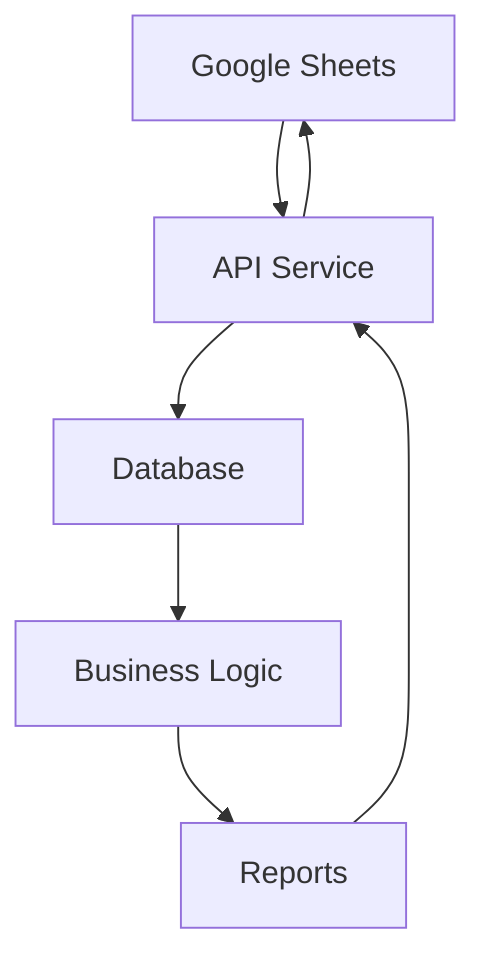

# Google Sheets Integration Guide

## Overview
Google Sheets will serve as a flexible interface for budget tracking, manual data entry, and custom calculations. This guide outlines the integration approach using Google Sheets API v4.

## Setup Requirements

### 1. Google Cloud Project Setup
1. Create a Google Cloud Project
2. Enable Google Sheets API
3. Create service account credentials
4. Download JSON key file

### 2. Google Sheets Template
Create a master spreadsheet with the following structure:

#### Sheet 1: Transactions
| Date | Type | Category | Description | Amount | Account | Tags |
|------|------|----------|-------------|--------|---------|------|
| 2024-01-15 | Expense | Food | Groceries | -150.00 | Checking | monthly |
| 2024-01-16 | Income | Salary | Paycheck | 3000.00 | Checking | income |

#### Sheet 2: Budget
| Category | Monthly Budget | Spent | Remaining | % Used |
|----------|----------------|-------|-----------|---------|
| Food | 500 | 150 | 350 | 30% |
| Transportation | 200 | 75 | 125 | 37.5% |

#### Sheet 3: Goals
| Goal | Target Amount | Current Amount | Progress % | Target Date |
|------|--------------|----------------|------------|-------------|
| Emergency Fund | 10000 | 7500 | 75% | 2024-06-01 |
| Vacation Fund | 5000 | 2000 | 40% | 2024-08-01 |

#### Sheet 4: Reports
| Metric | Value | Last Updated |
|--------|-------|--------------|
| Net Worth | 50000 | 2024-01-15 |
| Monthly Savings Rate | 25% | 2024-01-15 |

## API Implementation

### 1. Authentication Setup
```javascript
const { google } = require('googleapis');

class GoogleSheetsService {
  constructor() {
    this.auth = new google.auth.GoogleAuth({
      keyFile: 'path/to/service-account-key.json',
      scopes: ['https://www.googleapis.com/auth/spreadsheets']
    });
    
    this.sheets = google.sheets({ version: 'v4', auth: this.auth });
  }
}
```

### 2. Read Data from Sheets
```javascript
async readTransactions(spreadsheetId, range = 'Transactions!A2:G') {
  try {
    const response = await this.sheets.spreadsheets.values.get({
      spreadsheetId,
      range
    });
    
    return this.parseTransactions(response.data.values);
  } catch (error) {
    console.error('Error reading transactions:', error);
    throw error;
  }
}

parseTransactions(rows) {
  return rows.map(row => ({
    date: new Date(row[0]),
    type: row[1],
    category: row[2],
    description: row[3],
    amount: parseFloat(row[4]),
    account: row[5],
    tags: row[6] ? row[6].split(',') : []
  }));
}
```

### 3. Write Data to Sheets
```javascript
async updateBudget(spreadsheetId, budgetData) {
  const values = budgetData.map(item => [
    item.category,
    item.monthlyBudget,
    item.spent,
    item.remaining,
    `${((item.spent / item.monthlyBudget) * 100).toFixed(1)}%`
  ]);

  try {
    await this.sheets.spreadsheets.values.update({
      spreadsheetId,
      range: 'Budget!A2:E',
      valueInputOption: 'USER_ENTERED',
      resource: { values }
    });
  } catch (error) {
    console.error('Error updating budget:', error);
    throw error;
  }
}
```

### 4. Sync with Database
```javascript
async syncWithDatabase(spreadsheetId) {
  // Read from Google Sheets
  const transactions = await this.readTransactions(spreadsheetId);
  const budget = await this.readBudget(spreadsheetId);
  
  // Update database
  await this.updateDatabaseTransactions(transactions);
  await this.updateDatabaseBudget(budget);
  
  // Generate reports
  const reports = await this.generateReports();
  await this.updateReports(spreadsheetId, reports);
}
```

## Data Flow Architecture

### 1. Bidirectional Sync


### 2. Real-time Updates
```javascript
// Webhook for real-time updates
app.post('/api/sheets/webhook', async (req, res) => {
  const { spreadsheetId, range } = req.body;
  
  // Trigger sync when sheet is updated
  await googleSheetsService.syncWithDatabase(spreadsheetId);
  
  res.status(200).json({ message: 'Sync triggered' });
});
```

## Advanced Features

### 1. Formula Support
```javascript
// Update cells with formulas
async updateWithFormula(spreadsheetId, range, formula) {
  await this.sheets.spreadsheets.values.update({
    spreadsheetId,
    range,
    valueInputOption: 'USER_ENTERED',
    resource: {
      values: [[formula]]
    }
  });
}

// Example: Calculate running total
await this.updateWithFormula(
  spreadsheetId,
  'Transactions!H2',
  '=SUM($E$2:E2)'
);
```

### 2. Conditional Formatting
```javascript
async addConditionalFormatting(spreadsheetId) {
  const request = {
    addConditionalFormatRule: {
      rule: {
        ranges: [{ sheetId: 0, startRowIndex: 1, endRowIndex: 1000 }],
        booleanRule: {
          condition: { type: 'NUMBER_LESS_THAN', values: [{ userEnteredValue: '0' }] },
          format: { backgroundColor: { red: 1, green: 0.8, blue: 0.8 } }
        }
      }
    }
  };

  await this.sheets.spreadsheets.batchUpdate({
    spreadsheetId,
    resource: { requests: [request] }
  });
}
```

### 3. Data Validation
```javascript
async addDataValidation(spreadsheetId) {
  const request = {
    setDataValidation: {
      range: { sheetId: 0, startRowIndex: 1, endRowIndex: 1000, startColumnIndex: 1, endColumnIndex: 2 },
      rule: {
        condition: {
          type: 'ONE_OF_LIST',
          values: [{ userEnteredValue: 'Income' }, { userEnteredValue: 'Expense' }]
        },
        showCustomUi: true,
        strict: true
      }
    }
  };

  await this.sheets.spreadsheets.batchUpdate({
    spreadsheetId,
    resource: { requests: [request] }
  });
}
```

## Error Handling and Monitoring

### 1. Rate Limiting
```javascript
class RateLimitedSheetsService extends GoogleSheetsService {
  constructor() {
    super();
    this.requestQueue = [];
    this.maxRequestsPerMinute = 60;
    this.requestCount = 0;
    this.lastReset = Date.now();
  }

  async makeRequest(requestFn) {
    // Implement rate limiting logic
    if (this.requestCount >= this.maxRequestsPerMinute) {
      const waitTime = 60000 - (Date.now() - this.lastReset);
      await new Promise(resolve => setTimeout(resolve, waitTime));
      this.requestCount = 0;
      this.lastReset = Date.now();
    }

    this.requestCount++;
    return requestFn();
  }
}
```

### 2. Error Recovery
```javascript
async retryRequest(requestFn, maxRetries = 3) {
  for (let i = 0; i < maxRetries; i++) {
    try {
      return await requestFn();
    } catch (error) {
      if (i === maxRetries - 1) throw error;
      
      // Exponential backoff
      await new Promise(resolve => setTimeout(resolve, Math.pow(2, i) * 1000));
    }
  }
}
```

## Security Best Practices

### 1. Service Account Security
- Store service account key securely
- Use environment variables for sensitive data
- Implement key rotation
- Restrict API access to specific spreadsheets

### 2. Data Validation
```javascript
validateTransactionData(data) {
  const required = ['date', 'type', 'category', 'amount'];
  const missing = required.filter(field => !data[field]);
  
  if (missing.length > 0) {
    throw new Error(`Missing required fields: ${missing.join(', ')}`);
  }
  
  if (isNaN(data.amount)) {
    throw new Error('Amount must be a valid number');
  }
}
```

## Implementation Checklist

### Setup Phase
- [ ] Create Google Cloud Project
- [ ] Enable Google Sheets API
- [ ] Create service account
- [ ] Set up authentication

### Template Creation
- [ ] Create master spreadsheet template
- [ ] Set up data validation rules
- [ ] Add conditional formatting
- [ ] Create sample data

### API Development
- [ ] Implement read operations
- [ ] Implement write operations
- [ ] Add error handling
- [ ] Implement rate limiting

### Integration
- [ ] Connect with database
- [ ] Set up bidirectional sync
- [ ] Implement real-time updates
- [ ] Add monitoring and logging

## Next Steps

1. **Set up Google Cloud Project**
   - Create project and enable APIs
   - Generate service account credentials
   - Set up authentication

2. **Create Spreadsheet Template**
   - Design sheet structure
   - Add formulas and formatting
   - Test with sample data

3. **Implement API Service**
   - Build basic CRUD operations
   - Add error handling
   - Implement sync logic

4. **Integrate with Application**
   - Connect to database
   - Set up scheduled sync
   - Add real-time updates
